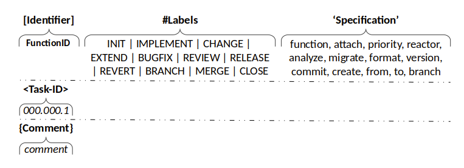

# Version control (Git)

## Repository Commit Messages

A commit message must consist of the following parts:

**FunctionID** 
This identifier should contain the project identifier. This project identifier are defined for each project / app in jira.  
**ADK Identifier:** CORE, DEV, SYS, ADK, FT, CM, DM 
* CORE = core folder 
* SYS = system folder 
* DEV = dev folder 
* FE = frontend folder 
* ADK = bin,www folder and all what is not suitable 
* CM = Configuration Management 
* DOC = Documentation Management 

**Label** 
Choose one of the labels that fits the change in your commit.

1. \#INIT  – Initialize a new repo or release 
repro:documentation / configuration … 
archetype:jar / war / ear / pom / zip … 
version:version
2. \#IMPLEMENT  – Implement a new Function, Class, Component or Use case 
function:clazz 
create:clazz / compontent 
use-case:usecaze 
3. \#CHANGE – Change a exists function,class or component 
function:clazz 
refactor:clazz / function / component / use-case... 
4. \#EXTEND  – Extend a exists function,class or component 
function:clazz 
attach:clazz / component / use-case ... 
5. \#BUGFIX   
priority:critical / medium / low / design 
6. \#REVIEW  – Quality
refactor:function 
analyze:quality 
migrate:function 
format:source 
7. \#RELEASE   
version:version 
8. \#REVERT  – Revert a Revision 
commit:id 
9. \#BRANCH  
create:name 
stash:branch 
10. \#MERGE   
from:branch 
to:branch 
11. \#CLOSE  
branch:name 

**Task-ID** 
This ID is the issue ID generated by JIRA.