# Development Process (Erzeugung eines Business Models)

Utensilien
-----------

1) Mysql Workbench 
2) Mysql Workbench Plugin "Business-Model-Json-Generator" 
3) bumogen 

Legende
--------

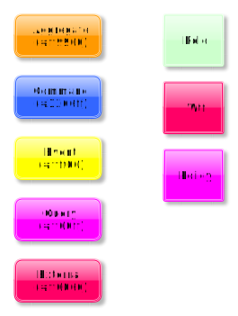

Abkürzungen
------------

MW &nbsp;- Mysql Workbench 
BC &nbsp; - Bounded Context 
ETC - Event Timeline Context 
CTC - Command/Query Timeline Context 
BU &nbsp;&nbsp;- Business Model 
ER &nbsp;&nbsp;- Entity Relation 
AR &nbsp;&nbsp;- Aggregate Root 
VO &nbsp;&nbsp;- Value Object 
CE &nbsp;&nbsp;- Child Entity

Was muss ich vorab tun?
-----------------------

1) **Plugin installieren** über MW -> Scripting -> Install Plugin (das Plugin liegt im Projektverzeichnis unter dev/workbench_plugins 
2) **Benutzerdefiniertentyp ValueObject anlegen** unter MW -> Model -> User Defined Types... mit dem Namen ValueObject rest ist egal.

Erstellen eines BU-Models (obligatorisch)
-------------------------

Nachdem anlegen eines Models in MW, erzeugt man zunächst einen Layer für die Context Map.
Dabei **muss** der Name folgender Konvention folgen: "**(BC) Appname**". 
In dem Layer legt man nun den/die BCs an, in dem man die Tabellen Komponente von MW benutzt.
Es ist zu empfehlen immer nur ein BC abzubilden, auch wenn theoretisch mehrere möglich sind, dient das der besseren Übersicht und Wiederverwendbarkeit   
Folgende Unterscheidungen existieren:

1) **Aggregate Root** (Farbe hellorange) 
2) **Child Entity** (Farbe hellblau) 
3) **Value Object** (Farbe rot)

In den Kommentarfeldern bzw. Descriptionfeld der Tabellen Komponente muss der Bezug angegeben werden.
Beim AR wäre es die Tabelle selbst. 

**Bsp:**
Tabelle task: aggregate=Task;

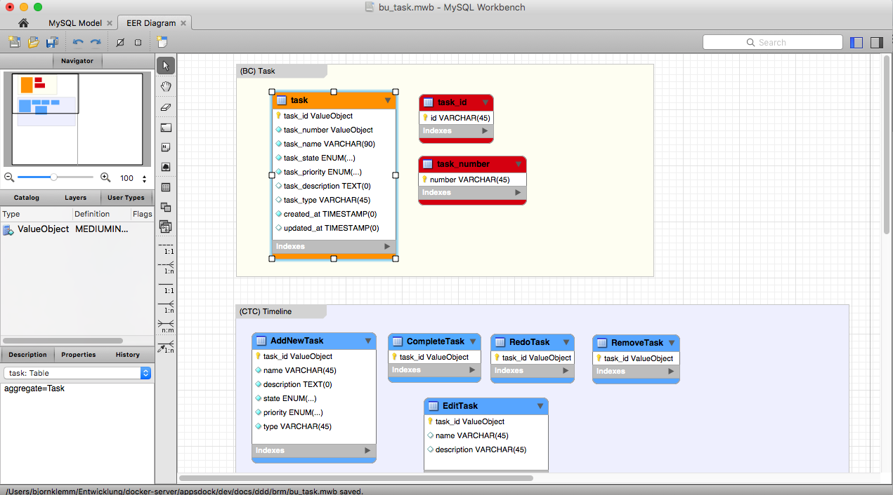

**WICHTIG: Jede Kommentarfeld Definition MUSS mit einem Semikolon abgeschlossen werden, wenn eine Zuweisung mittels = erfolgt** 

###### Mögliche Spalten-Definitionen:

1) **readonly** 
Nötig wenn kein CTC um dem Generator mitzuteilen, dass dieses Attribute nur im Query auftauchen, definiert werden darf
 
2) **writeonly** 
Nötig wenn kein CTC um dem Generator mitzuteilen, dass dieses Attribute nur im Command auftauchen, definiert werden darf
 
3) **write und read** 
Kombinierte Defintion von keiner Angabe readonly udn writeonly, dann taucht in beiden Command und Query das Attribute auf
 
4) **noinit** 
Erscheint nicht im Aggregate Konstruktor, Factory, oder Child-Method-Erzeugung
 
5) **transition** 
Wenn ein Enumfeld können hier die Zustandsübergänge angegeben werden
 
6) **nullable** 
Attribute kann Null sein (Haken bei NN)
 
7) **default** Attribute default Wert (Eintrag bei Defaultspalte), hier ist eine Besonderheit zu beachten, wird ein Wert bei der Objekterzeugen als default vom Aggregate gesetzt muss ein default Wert hier stehen ansonsten darf kein default Wert verwendet werden (siehe Image).
    In dem Bild sieht man das Enumfeld Priority, welches per Api oder UI übergeben werden muss (daher kein default Wert) und das Enumfeld state welches vom Aggregate, mit dem Wert 'OPEN' gesetzt wird, daher als default definiert. Damit der Code wie in dem Bild generiert werden kann, muss dieses Muster berücksichtig werden.

**Bsp. (default):**

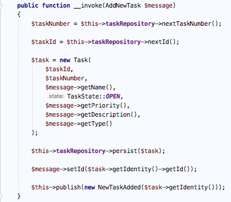

**Bsp. (transition):**

**Syntax:** name: from -> to

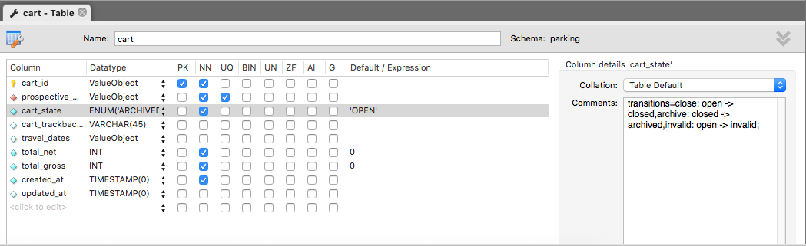

**Bsp. (noinit und readonly):**

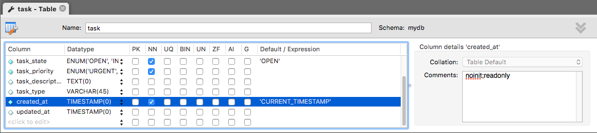

#### Value Objects

Bei einem VO (rot) werden die immutables Attribute in die VO-Tabelle geschrieben und als Description wieder der Bezug zum AR hergestellt: 
 **Bsp: valueobject=Task**  
In der AR-Tabelle wird als Spalte der Name des VOs aufgenommen mit unserem benutzerdefinierrten Typ ValueObject, das ist wichtig damit der Generator später entsprechend die xml-Files und Klassen erstellen kann

Einzelne Attribute können über das Kommentarfeld als readonly oder writeonly gesetzt werden. Wird nichts angegeben, werden
beide Flags auf true gesetzt.

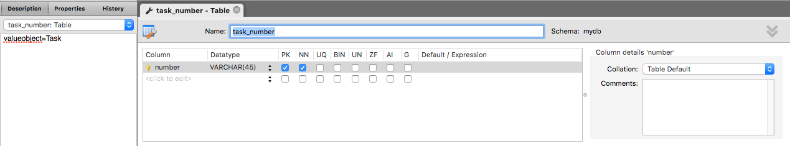

Erstellen von Command und Query Timelines (optional)
-----------------------

Für die Timelines müssen weitere Layer erzeugt werden, pro Timeline ein Layer. Dabei **muss** der Name folgender Konvention folgen:
(CTC) Use Case Name. Die Timeline sollte die Zeitline des UseCases abbliden und nicht wahrlos die Tabellen darin platziert werden.
In dem Layer legt man nun die CTCs an, in dem man die Tabellen Komponente von MW benutzt. Folgende Unterscheidungen
existieren:

1) Command 
2) Query

###### Standard Use Cases

1) create 
2) update 
3) delete

Existiert kein CTC werden einfach Standard Commands, Queries, Events und Handler generiert, also z.B.
 Commands: CreateTask, UpdateTask, DeleteTask 
Events: TaskCreated,TaskUpdated,TaskDeleted 

In dem Fall ist es dann wichtig mit den Attributen <a href="#readonly">readonly</a> und <a href="#writeonly">writeonly</a> zu arbeiten.
 
###### Mögliche Definitionen:

1) **typ** Gibt den Timelinetyp an [command,query] 
2) **aggregate** Gibt den Bezug an  
3) **event** Wenn keine ETC Timeline erwünscht, kann hier das Event angegeben werden 
4) **resource** Wenn kein Standard Use Case verwendet wird kann mit resource der Name gemapped werden, dass ist notwendig damit der Generator später den Command entsprechend der Resource Methode zuweisen kann [create,update,delete] 
5) **default Wert** 

###### Mögliche Spalten-Definitionen:

siehe BU-Model 
1) **reference** Kann angegeben werden, um ein VO als BC-Grenzobjekt zu Kennzeichen, also was von einem anderem BC stammt, dadurch kann der Generator die entsprechende Code Logic im CommandHandler erzeugen (Inject Repository etc.) 
2) **generator** Kann angegeben werden, um ein VO als Nummergenerator zu kennzeichnen, dadurch generiert der Generator die ensprechende Codelogik in den Repositories und den CommandHandlern (der Generator muss später im Core existieren)

**Bsp. (reference):**

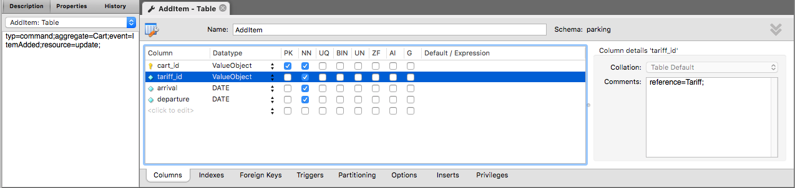

**Bsp. Code Commandhandler:**

Korrekte Zuordnung der Codegenerierung von Zeile 42-46 und 56,57 und 63 sind nur möglich durch die Angabe des reference Attributes.

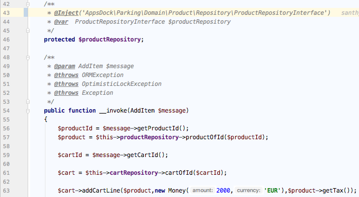

**Bsp. (generator):**

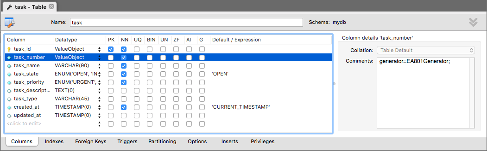

###### Code CommandHandler -> Generator (Zeile 50)

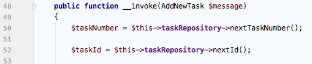

###### Code Repository -> Generator

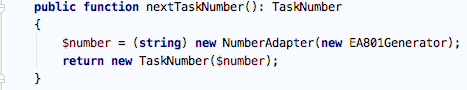

#### Zusammenfassung

In den Tabellen definiert man die jeweilgen Attribute als Spalten. Bei den Tabellen **muss** obligatorisch ein Typ im Kommentar
bzw Description Feld eingetragen werden in der Form: **typ=command** für Command und **typ=query** für Query.
Bei den Events **muss** eine zusätzliche Angabe erfolgen und zwar der Bezug zum Command, wenn kein ETC existiert. 
 **Bsp:** es gibt einen Command *AddNewTask* und ein Event *NewTaskAdded*, dann muss in dem Kommentarfeld des Commands,
Semikolon getrennt, folgendes stehen: **typ=command;aggregate=Task;event=NewTaskAdded;resource=create;**.

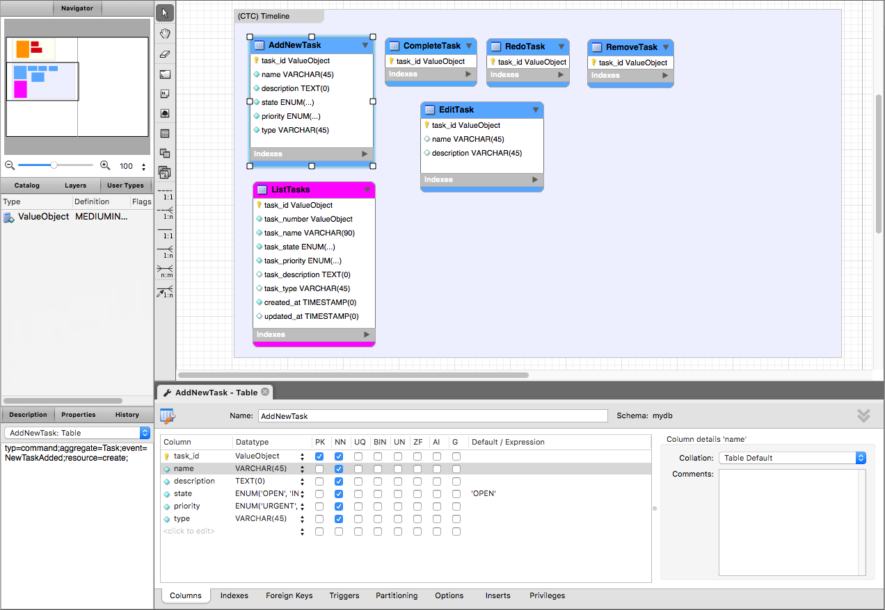

Erstellen von Event Timelines (optional)
-----------------------

Für die Timelines müssen weitere Layer erzeugt werden, pro Timeline ein Layer. Dabei **muss** der Name folgender Konvention folgen:
(ETC) Use Case Name. Die Timeline sollte die Zeitline des UseCases abbliden und nicht wahrlos die Tabellen darin platziert werden.
In dem Layer legt man nun die ETCs an, in dem man die Tabellen Komponente von MW benutzt. Folgende Unterscheidungen
existieren:

1) Event  

###### Mögliche Definitionen:

1) **typ** Gibt den Timelinetyp an [event] 
2) **aggregate** Gibt den Bezug an   (deprecated)
3) **command** Gibt den Bezug an  
4) **listeners** Welche Aggregate sollen benachrichtigt werden (kommasepariert). Notwendig damit die entsprechenden Listener, in den BCs, generiert werden.

In den Tabellen definiert man die jeweilgen Attribute als Spalten. Bei den Tabellen **muss** obligatorisch ein Typ im Kommentar
bzw Description Feld eingetragen werden in der Form: **typ=event** für Event.
Bei den Events **muss** eine zusätzliche Angabe erfolgen und zwar der Bezug zum Command.
Bsp: es gibt einen Command *AddNewTask* und ein Event *NewTaskAdded*, dann muss in dem Kommentarfeld des Events,
Semikolon getrennt, folgendes stehen: **typ=event;aggregate=Task;command=AddNewTask;listeners=Todo,Help;**.

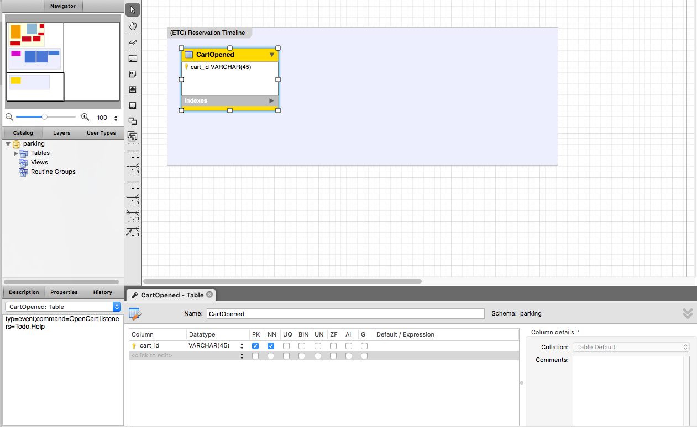

#### Frontendentwicklung

Durch Commands und Queries kann zusätzlich die Frontendgenerierung gesteuert werden.

###### Mögliche Definitionen (Query only):

1) **component** Angabe einer Vue-Komponente welche beim Generierungsprozess benutzt werden soll.

###### Mögliche Spalten-Definitionen (Commands only):

1) **inputType** Der Typ des Formelements 
2) **group** group=name gibt an das dieses Formelement in (name) als Accordion zusammengefasst wird 
3) **line** Angabe welche Elemente horizontal in einer Zeile des Forms zusammengefasst werden können.

**Mögliche Input Types**:  
text, textarea, date, datetime, time, select, switch, wysiwyg, number, slider, color, radio, checkbox

**Bsp:** 

Per Angabe von name-6 kann in einem 24 Grid der Platz angegeben werden. Angenommen man möchte in einer Zeile Vorname, Nachname
unter dem Namen *Name* in der Group *Allgemein* haben und Ankunft und Abreise in einer Zeile unter der Group *Extra*, 
jeweils als col-6. Dann muss man den jeweiligen Attributen folgendermaßen definieren:

Attribut firstname: group=General;line=name-6;inputType=text; 
Attribut surname: group=General;line=name-6;inputType=text; 
Attribut arrival: group=States;line=extras-6;inputType=date; 
Attribut departure: group=States;line=extras-6;inputType=date;

Wird zu folgendem generiert:

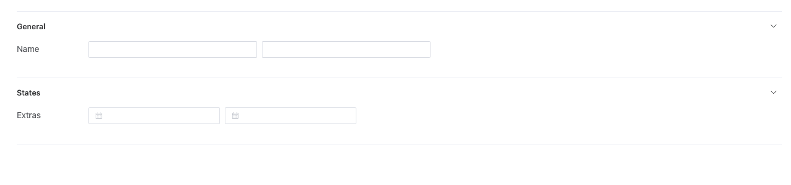

#### Troubleshoots

1) **Leerstring im Json-File bei properties** eigentlich nur bei ValueObject möglich. Ursache ist wenn ValueObjects Tabellenname = dem Columnname ist. 
    Bsp: ValueObject Tabelle heißt task_number, dann muss die Property "number" heißen, also nicht "task_number", daher resultiert Punkt 2. 
2) **Identity VOs** sind eine Ausnahme und müssen/brauchen nicht dargestellt werden, da sie in der Aggregate Tabelle schon gekennzeichnet sind, wenn doch Benennung siehe Punkt 1.

