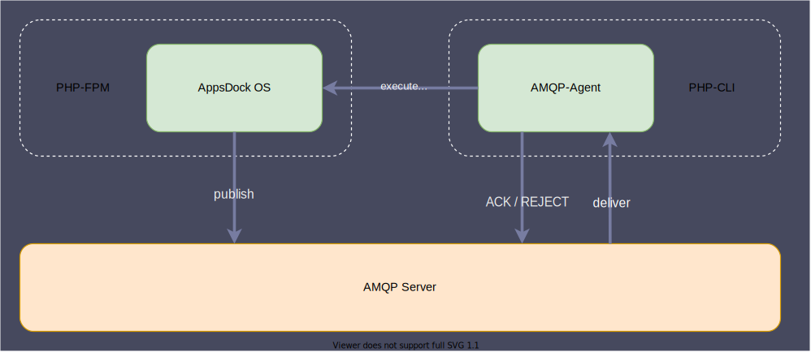

# Message Queue (AMQP)

AppsDock OS uses an AMQP based infrastructure to handle asynchronous messages, which allows executing long-running processes in the background by implementing async event handlers or async command executions via Message Bus within AppsDock OS.

## Composition

AppsDock OS provides a dedicated AMQP-Agent that acts as a consumer and mediator of messages. AppsDock OS avoids processing messages via CLI in consumer mode directly due to potential environment inequality between CLI and PHP-FPM and disregard of PHP-FPM process worker benefits. Instead, the dedicated AMQP-Agent consumes the messages from AMQP server and executes, controls and monitors asynchronous PHP-FPM process workers, which process the messages.  

### Publisher (AppsDock OS)

AppsDock OS uses the MessageBus component to publish messages to the AMQP server directly.  It does not provide any kind of consuming the published messages via AMQP server due to this responsibility is adopted by the AppsDock AMQP-Agent. Instead, AppsDock OS provides an internal and secured API endpoint to handle published messages which are provided by the AMQP-Agent. The handling of these messages over API uses also the MessageBus component.

### Consumer (AppsDock AMQP-Agent)

The dedicated AMQP-Agent, which is a part of the AppsDock Dedicated Services, is a scalable AMQP message consumer service. This service consumes the messages from the AMQP server directly and manage their processes and states in conjunction with PHP-FPM workers.

## Message Types (Subjects)

AppsDock OS uses different types of messages for different process purposes. Each type of message uses a specific php class as message body to represent the message content. AppsDock OS supports actually two kinds of message types: 
- event
- command.

Each message type has several allocated message queues to handle different process results.
- A main queue for delivery and processing
- A retry queue for delayed redelivery on failures
- A error queue for non-deliverable messages

### Event Message
The **event** message type is used to handle asynchronous event handlers via MessageBus. This type uses `AppsDock\Core\Event\Integration\IntegrationEvent` as content class and is basically used to publish integration events. 

### Command Message
The **command** message type is used to execute asynchronous command handlers via MessageBus. This type uses any class which is a type of `AppsDock\Core\Contracts\App\Application\Command` as content class.

## Approach in case of error

As already described above (Message Types), the AMQP-Agent defines **dedicated queues to handle failures**. If the process worker failed (any case), the message will be **rejected without a direct requeue**. Instead, the message will be moved automatically into the **retry queue** which keep the failed message for a certain time. After this time, this message is published back into the **main queue** for a retry. If this procedure fails for a certain number of retries, this message will be **dropped from main and retry** queue and published into the **error queue** for further investigation. 

*[AMQP]: Advanced Message Queuing Protocol
*[OS]: Operating System
*[CLI]: Command Line Interface
*[PHP]: Hypertext Preprocessor
*[FPM]: FastCGI Process Manager 