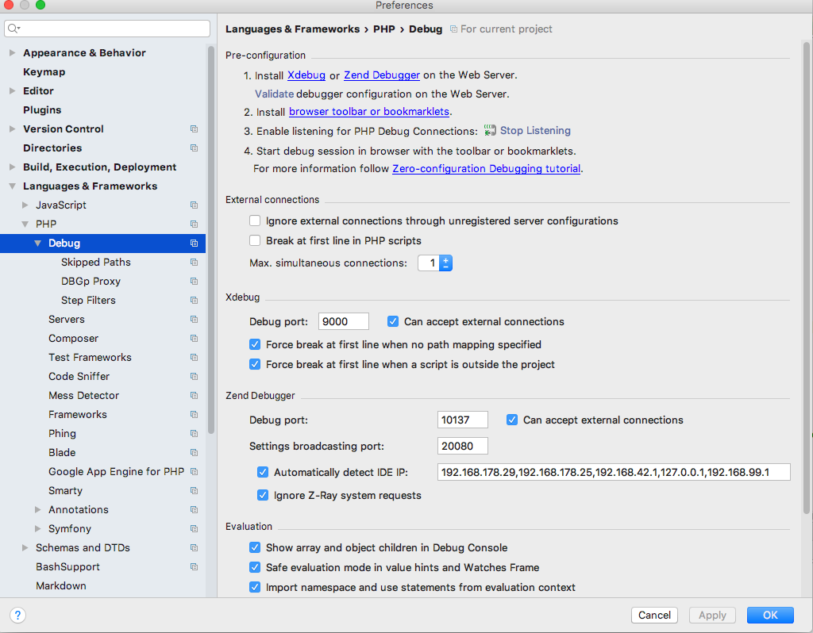
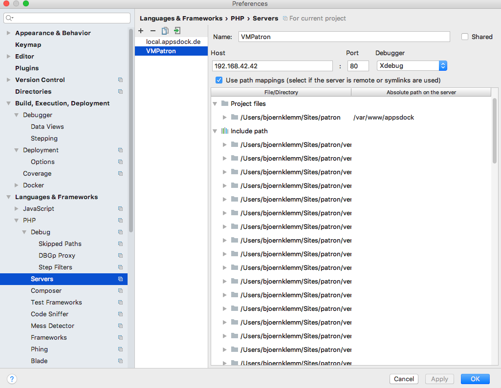

# Xdebug setup

## Step 1: PhpStorm

Follow the instructions on the screenshot.

## Step 2: Server

Map local paths to remote paths.

## Step 2: Configuration

Got to **Run &#10095; Debug &#10095; Edit configurations &#10095; Expand defaults &#10095; PHP Remote debug** and select the server created in Step 2.

## Step 4: Listening

Go to **Run &#10095; Start listening for PHP connections** and start listening.

Then set a breakpoint in PhpStorm and call page in browser to test the setup.

*[PHP]: PHP: Hypertext Preprocessor
