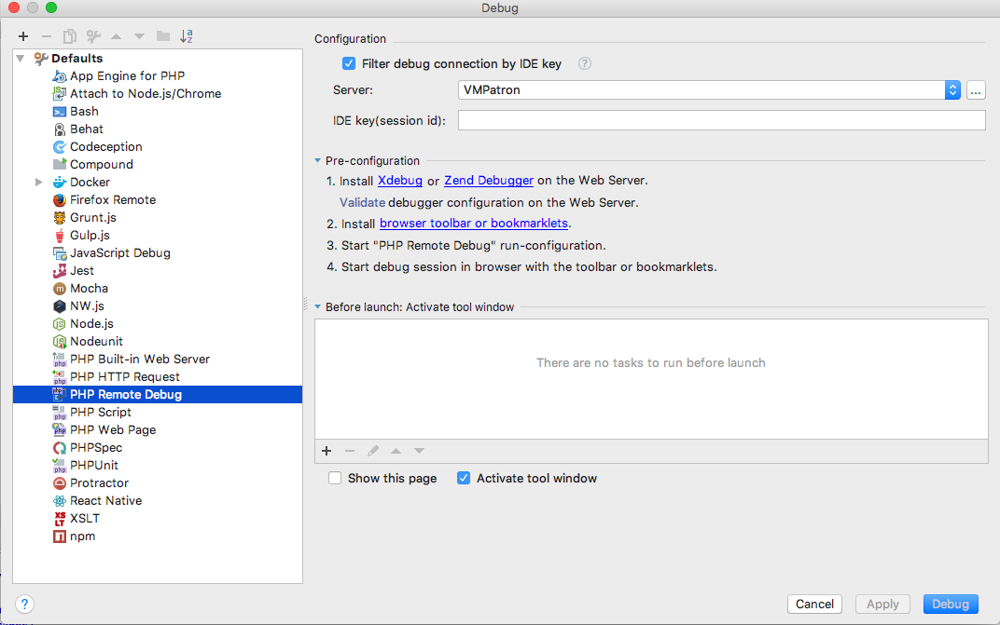

# Phpstorm Xdebug-Einrichtung

* Deployment-Konfiguration des Vagrant Box vollenden
* Überprüfung der Einstellung siehe Screenshot

### Server einrichten

**Wichtig! Das Mapping Local-Path zu Remot Path (Bild Project Files)**

### Debugkonfiguration

Run -> Debug -> Edit Configurations -> Defaults aufklappen -> Php Remote Debug

Dort den in Schritt2 erstellten Server auswählen.

### Listening aktivieren

Run -> Start Listening for Php Connections

Dann Breakpoint setzen in Storm -> und Seite im Browser aufrufen et voila!!!
