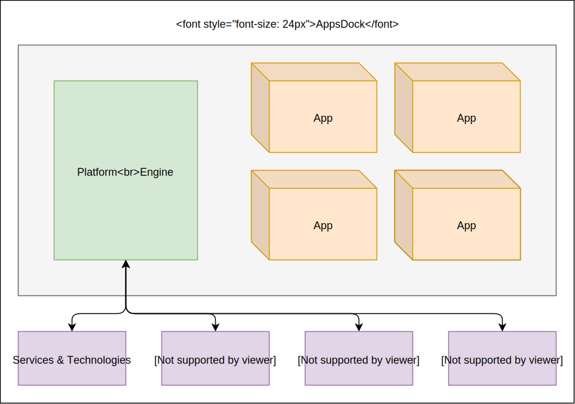

# AppsDock OS Documentation

This documentation is about the development of AppsDock, a PHP based enterprise platform for business applications. By reading this documentation you will learn the concept, composition and the development aspects of the AppsDock platform. You will be able to maintain, develop, adapt and extend the platform by writing apps, extension and plugins.

## Concept

The AppsDock platform provides an universal foundation which is able to run a large scale of business apps.

