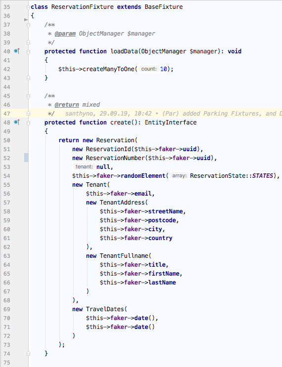
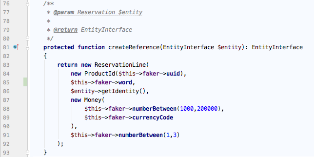
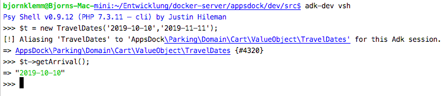

# Development Process (App und Aggregate Generierung)

Generieren der Model-Json-Files
-------------------------------

Das in Schritt 1 installierte Plugin kann in MW unter **"Tools -> Utilities -> Business-Model-Json-Generator"** ausgeführt werden.
Der Speicherort der Dateien kann x-beliebig sein.

Das bumo-Script, welches die PHP-Klassen, App und Aufbau-Logik generiert, kann nun auf die Json-Dateien angewandt werden.

### Allgemeines

Anzeige der Hilfe
<pre>./bumo help</pre>  
Auflistung der vorhandenen, einzel ausführbaren Commands
<pre>./bumo list</pre>
**App erzeugen**
<pre>./bumo app:init appname</pre> 
oder die Kurzform 
<pre>./bumo a:i appname</pre>
**Aggregate erzeugen**
<pre>./bumo app:generate-aggregate appname aggregate</pre> 
oder in Kurzform 
<pre>./bumo a:g appname aggregate</pre>

Letzteres kann mit der -f oder --file Option so ausgeführt werden das man den Ort der Json Dateien als Pfad angeben kann,
wenn man die BU-Json-Dateien nicht im Projektverzeichnis unter apps/appname/setup/defs abgespeichert hat, was der Standard
Suchpfad ist bei Angabe von Option --f ohne Pfad. Allgemeiner Standardpfad ist getcwd. Wenn die App jedoch noch nicht existiert, kann sie zum einem über den init Befehl angelegt werden, muss jedoch nicht
da auch der Generate-Befehl das Projektverzeichnis anlegt.

Bsp.: <pre>./bumo a:g task Task</pre>

Alle Commands sind einzeln ausführbar, man kann also z.B. nur die Handler neu generieren lassen mit dem Befehl: 
<pre>./bumo command:handler task Task</pre>

### Empfohlenes Vorgehen

Im Verzeichnis dev/workbench_plugins liegt eine Example.json welche für den Guide hier Verwendung findet

Vorab (Globalen Link für codeception setzen, um es von jedem Verzeichnis ausführen zu können):
<pre>ln -s PROJECT_ROOT/vendor/bin/codecept /usr/local/bin/codecept</pre>

1) **App erzeugen** (Dadurch wird das Testverzeichnis gebootstrapped und die App wird in der Datenbank registriert)
    <pre>./bumo a:i example</pre>
2) **Aggregate generieren**
    <pre>./bumo a:g example Example -f ./workbench_plugins</pre>
3) **Erzeugen der Datenbanktabelle**
    Vorab Ausführungssql ansehen (wird noch nichts erzeugt)
    <pre>./bumo schema create example --dump</pre>
    Erzeugen
    <pre>./bumo schema create example</pre>
4) **Testausführen** (Erzeugen eines Examples)
    <pre>cd PROJECT_ROOT codecept run api -c apps/example/tests</pre>

Wenn der Test positiv ist, existiert nun ein Objekt in der Datenbank. Es wurde erfolgreich erstellt und wieder ausgelesen.

### Aktualisierung

1) **Aggregate regenerieren**
    <pre>./bumo a:g example Example -f ./workbench_plugins</pre>
2) **Änderung Mergen** 
    Unter *dev/.appsdock* existiert jetzt ein Verzeichniss mit dem Aggregatenamen "example", worin einmal eine Patch-Datei und die veränderte Code-Datei dafür liegen, letztere in PHP-Storm auswählen und mit "Compare with..." mit der Originalen vergleichen und manuell mergen.  
3) **Aktualisierung der Datenbanktabelle**
    Vorab Ausführungssql ansehen (wird noch nichts erzeugt)
    <pre>./bumo schema update example --dump</pre>
    Aktualisieren
    <pre>./bumo schema update example</pre>
4) **Testausführen** (Erzeugen eines Examples)
    <pre>cd PROJECT_ROOT codecept run api -c apps/example/tests</pre>

Wenn der Test positiv ist, existiert nun ein Objekt in der Datenbank. Es wurde erfolgreich erstellt und wieder ausgelesen.

### Datenbanktabelle seeden

1) **Fixture anlegen** 
    Im Ordner *tests/Fixture* (wenn nicht vorhanden anlegen) eine Klasse erstellen mit der Namenskonvention "AggregateFixture" und diese von BaseFixture erben lassen. 
     
2) **Seeden** 
    <pre>./bumo db:seed example Example</pre>

Komplexeres Beispiel mit Reference: 

### Stubs Generierung

1) **Subs generieren** 
    <pre>./bumo stub:generate path outpath</pre>
    
### Appsdock Console nutzen (schnelle Überprüfung von Funktionen,History,Autocomplete)  

1) **Console starten** 
    Alle Klassen werden direkt ohne Namespace in die Consolensession geladen und sämtliche Operationen können darauf ausgeführt werden.
    <pre>./bumo vsh</pre>

In dem Beispiel, wurde einfach das ValueObject TravelDates aus der Parking App mit 'new' erzeugt und eine Get-Funktion darauf ausgeführt.  

 
### Datenbank Yaml-Dateien generieren  

1) **Yaml generieren** 
    Die Yaml-Dateien findet man dann im *apps/example/setup/db* Verzeichnis. 
    <pre>./bumo db:yml example Example</pre>

### Troubleshoots

**Bekannte Fehlerfälle:** 

1) **Schema update:** MysqlPlatform wird nicht unterstützt, damit auch für Mysql das Schema aktualisiert werden kann, muss in Doctrine in der Klasse SchemaTool Zeile 357 auskommentiert werden. 
2) **Identity.xml ValueObject definition not found** Hotfix: bei dem sich handelten Aggregate, eine Fake xml Datei (AggregateId.xml) in dem orm xml VO Verzeichniss erstellen. Dabei den Dateinamen natürlich ersetzen mit dem aus der Fehlermeldung.